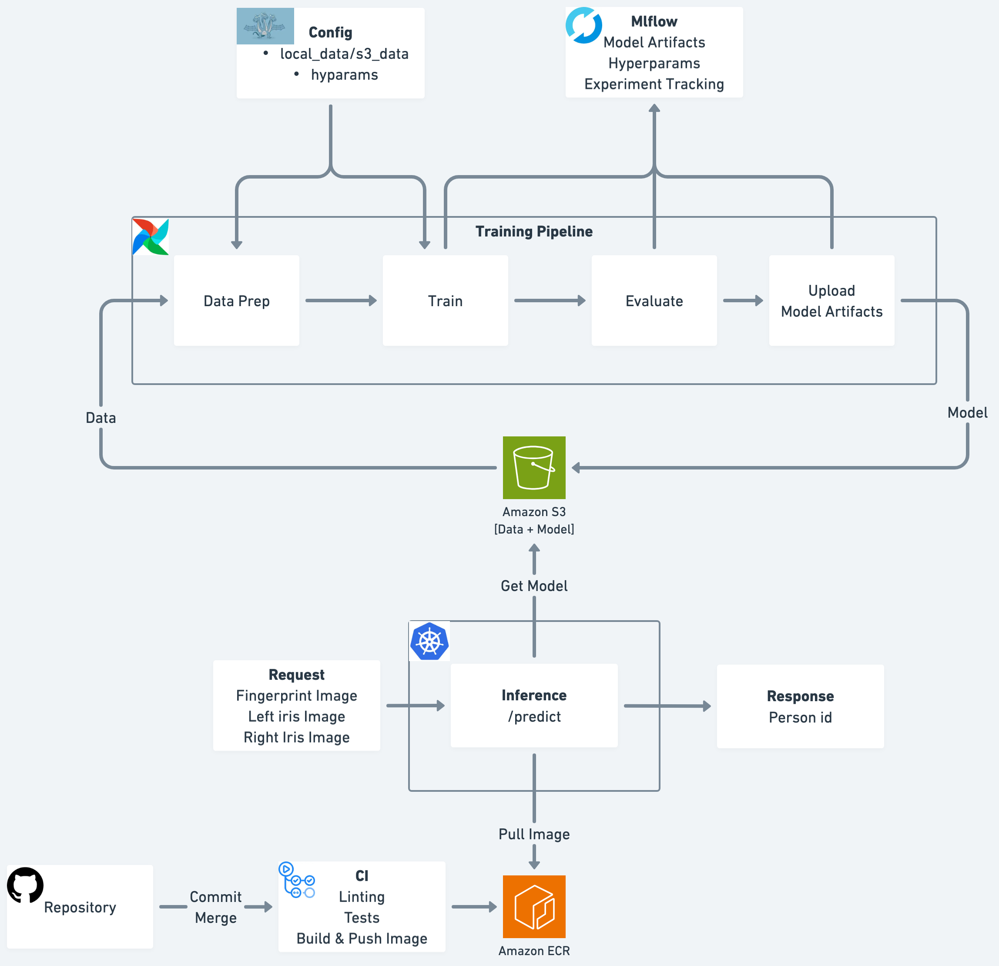

# Multimodal Biometric Recognition System

A PyTorch-based multimodal biometric recognition system that uses fingerprints and iris images for person identification.

## System Design



## Quick Start

```bash
# Install
poetry install

# Train
poetry run train

# Serve API
poetry run serve

# Run with Docker Compose (MLflow + Airflow)
docker-compose up -d
```

## Model Architecture

| Component          | Architecture                        | Output Dim  |
| ------------------ | ----------------------------------- | ----------- |
| Fingerprint Branch | MobileNetV2 (pretrained, frozen)    | 1280        |
| Iris Branch        | 2x Conv2D + MaxPool + GlobalAvgPool | 32 (shared) |
| Fusion Module      | Linear(1344→128) + ReLU + Dropout  | 128         |
| Classifier         | Linear(128→num_classes)            | num_classes |

## Project Structure

```
src/biometric_recognition/
├── api/           # FastAPI server (serve.py, schema.py)
├── data/          # BiometricDataset class
├── models/        # Model architecture (branches.py, multimodal_model.py)
├── pipeline/      # Training stages (data_prep, train, evaluate, upload)
├── utils/         # Utilities (aws, mlflow, metrics, training, etc.)
└── train.py       # Main training script

airflow/           # Airflow DAG for pipeline orchestration
k8s/               # Kubernetes deployment manifests
terraform/         # AWS infrastructure (ECR, S3)
configs/           # Hydra configuration
```

## Training

```bash
# Local training
poetry run train

# With custom parameters
python src/biometric_recognition/train.py training.epochs=20 data.batch_size=16

# Via Airflow
docker-compose exec airflow-webserver airflow dags trigger biometric_training_pipeline
```

### Pipeline Stages

| Stage     | Description              | Outputs                            |
| --------- | ------------------------ | ---------------------------------- |
| data_prep | Create stratified splits | `data_splits.json`               |
| train     | Train with validation    | `best_model.pth`                 |
| evaluate  | Test set evaluation      | `evaluation_results.json`, plots |
| upload    | Upload artifacts to S3   | S3 URIs                            |

## API Server

```bash
poetry run serve
```

| Endpoint        | Method | Description         |
| --------------- | ------ | ------------------- |
| `/health`     | GET    | Health check        |
| `/predict`    | POST   | Predict from images |
| `/model/info` | GET    | Model metadata      |
| `/docs`       | GET    | Swagger UI          |

### Example Request

```python
import requests

files = {
    "fingerprint": open("fingerprint.bmp", "rb"),
    "left_iris": open("left_iris.bmp", "rb"),
    "right_iris": open("right_iris.bmp", "rb"),
}
response = requests.post("http://localhost:8000/predict", files=files)
print(response.json())
# {"predicted_class": 12, "confidence": 0.95, "top_k_predictions": [...]}
```

## Deployment

### Kubernetes

```bash
kubectl create secret generic aws-credentials \
  --from-literal=AWS_ACCESS_KEY_ID=<key> \
  --from-literal=AWS_SECRET_ACCESS_KEY=<secret>

kubectl apply -f k8s/
```

### Terraform (AWS Infrastructure)

```bash
cd terraform && terraform init && terraform apply
```

Creates: ECR repository, S3 bucket (versioning + encryption enabled)

## Configuration

Key settings in `configs/config.yaml`:

```yaml
data:
  path: "s3://biometric-recognition-artifacts/biometric_data/"
  batch_size: 8
  num_workers: 8

model:
  backbone_name: "mobilenetv2_100"
  dropout: 0.5

training:
  epochs: 50
  learning_rate: 0.0001
  device: "auto"  # auto, cpu, cuda, mps
```

### Environment Variables

| Variable                | Description           | Default                        |
| ----------------------- | --------------------- | ------------------------------ |
| `MODEL_PATH`          | Model checkpoint path | `checkpoints/best_model.pth` |
| `NUM_CLASSES`         | Number of classes     | 45                             |
| `MLFLOW_TRACKING_URI` | MLflow server URL     | `http://localhost:5000`      |

## Development

```bash
# Code quality
poetry run black src/
poetry run isort src/
poetry run flake8 src/
poetry run mypy src/

# Tests
poetry run pytest
```

## Service URLs

| Service    | URL                   | Credentials   |
| ---------- | --------------------- | ------------- |
| Airflow UI | http://localhost:8080 | admin / admin |
| MLflow UI  | http://localhost:5000 | -             |
| API        | http://localhost:8000 | -             |

## License

MIT License
